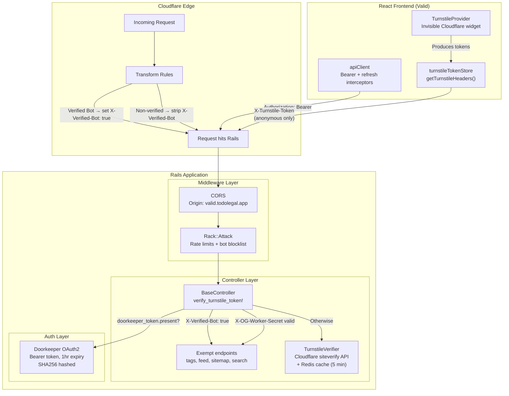
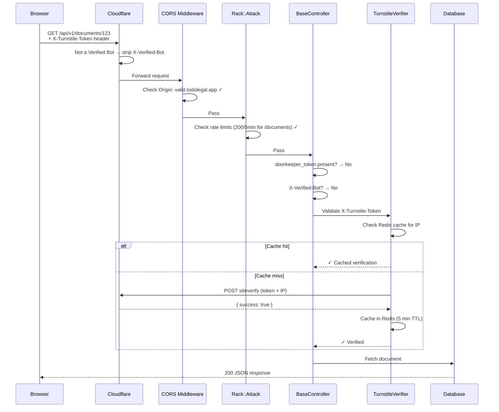
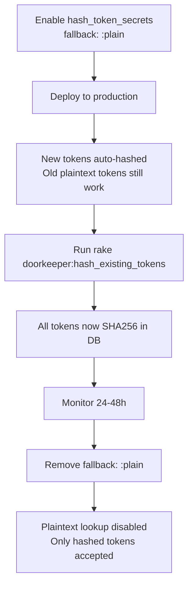
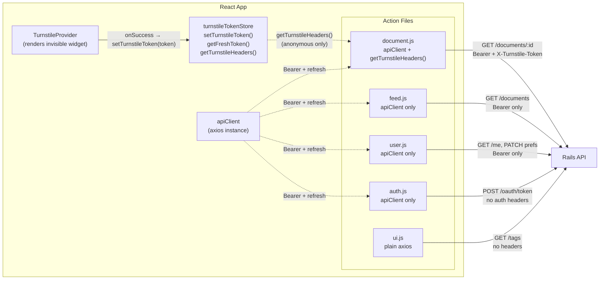
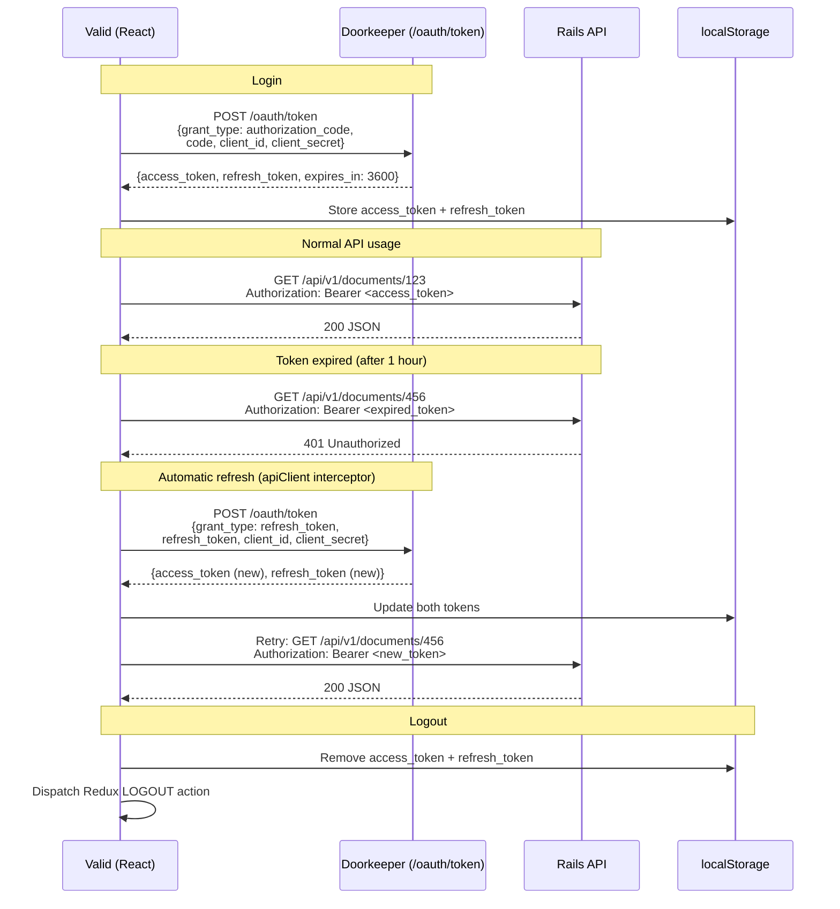

# API Security Architecture — TodoLegal

**Created:** May 1, 2026
**Status:** Phases 1–5 complete. Phase 6 (legacy cleanup) complete.
**Scope:** Feb–May 2026 sprint. Converted the API from public to private-to-Valid.

---

## Executive Summary

TodoLegal's API was fully public — any script, browser, or bot could consume all endpoints without restriction. This project implemented a 3-layer defense system (Cloudflare Edge, application middleware, and OAuth2 authentication) to restrict API access to the Valid frontend and authorized users while preserving SEO and unauthenticated document browsing for legitimate visitors.

---

## Problem Statement

Before this project, the API had the following vulnerabilities:

- **No access restriction** — any `curl`, Python script, or browser on any domain could call all API endpoints and retrieve full document data.
- **No CORS** — cross-origin requests were accepted from any origin (`origins '*'`).
- **No bot protection** — AI crawlers (GPTBot, ClaudeBot, ByteSpider) and scraping tools freely consumed document content. No rate limiting existed.
- **Weak token security** — OAuth access tokens had a 2-month expiry, were stored as plaintext in the database, and were sent as `?access_token=` query parameters (visible in logs and browser history).
- **Data exposure** — the `/me` endpoint returned the full User model including `encrypted_password`, `otp_secret`, and other sensitive fields.
- **Legacy dead code** — the `simple_token_authentication` gem and `authentication_token` column remained in the codebase, adding unnecessary attack surface.
- **No refresh flow** — the React frontend had no token refresh mechanism. With the planned shorter expiry, users would be logged out every hour.

---

## Solution Overview

Three enforcement layers, each independent:

1. **Cloudflare Edge** — Verified Bot identification via Transform Rules. Legitimate crawlers are tagged; spoofed bot headers are stripped.
2. **Application Middleware** — CORS restricts browser requests to Valid's domain. Rack::Attack rate-limits and blocks malicious user agents. Turnstile verifies that unauthenticated requests come from a real browser.
3. **Authentication** — Doorkeeper OAuth2 with Bearer tokens, 1-hour expiry, refresh token rotation, and SHA256 token hashing.

---

## System Architecture



---

## Request Flow

### Anonymous Visitor — Viewing a Document



---

## Defense Layers

### A. Cloudflare Edge Layer

**Verified Bot Transform Rules**

Cloudflare's `cf.client.bot` field identifies legitimate crawlers (Googlebot, Bingbot, etc.) using reverse DNS verification — not user-agent strings, which can be spoofed.

Two Transform Rules are configured:

| Rule | Condition | Action |
|------|-----------|--------|
| Set Verified Bot header | `cf.client.bot == true` | Set `X-Verified-Bot: true` request header |
| Strip spoofed header | `cf.client.bot == false` | Remove `X-Verified-Bot` header |

Rails trusts `X-Verified-Bot: true` because Cloudflare guarantees only verified bots carry this header. Non-verified requests have the header stripped before reaching Rails.

**WAF Bot Score Rules** — Cloudflare Pro plan does not expose `cf.bot_management.score` in WAF Custom Rules. This was evaluated and deferred. If TodoLegal upgrades to Enterprise, bot-score blocking can be added at the edge.

---

### B. Middleware Layer

#### CORS

Configured in `config/initializers/cors.rb`. Browser requests are restricted to origins in the `CORS_ALLOWED_ORIGINS` environment variable. Default: `https://valid.todolegal.app`.

```ruby
allowed_origins = ENV.fetch('CORS_ALLOWED_ORIGINS', 'https://valid.todolegal.app').split(',')
origins(*allowed_origins)
```

`localhost` is included via the env var in development/staging environments. CORS does not affect non-browser clients (curl, scripts) — those are handled by Turnstile and Rack::Attack.

#### Rack::Attack

Configured in `config/initializers/rack_attack.rb`. Backed by Redis for consistency across processes.

**Safelists:**
- Localhost (`127.0.0.1`, `::1`)
- Legitimate crawlers (Googlebot, Bingbot, Facebook, Twitter, Slack, monitoring tools)

**Throttles:**

| Rule | Limit | Period | Scope |
|------|-------|--------|-------|
| Registration | 5 | 10 min | IP |
| Login (by email) | 5 | 20 min | Email |
| Login (by IP) | 10 | 15 min | IP |
| Documents API | 200 | 5 min | IP |
| Search API | 100 | 5 min | IP |
| General API | 300 | 5 min | IP |
| Sitemap | 10 | 1 min | IP |

**Blocklists:**
- Honeypot fields on registration (hidden form fields that bots fill in)
- Temporary email domains (yopmail.com, mailinator.com, etc.)
- Malicious/scraping user agents (python-requests, curl, scrapy, GPTBot, ClaudeBot, etc.)
- Fail2Ban-style IP banning (5 throttle violations in 5 min → 1 hour ban)

#### Turnstile Verification

Cloudflare Turnstile is an invisible browser challenge — no CAPTCHA, no user interaction. The widget solves automatically and produces a single-use token that the server validates via Cloudflare's `siteverify` API.

**Server-side flow** (`BaseController#verify_turnstile_token!`):

```
Request arrives at BaseController
├─ Doorkeeper token present? → SKIP (authenticated user)
├─ OG Worker secret valid? → SKIP (OpenGraph preview worker)
├─ X-Verified-Bot: true? → SKIP (Googlebot, Bingbot, etc.)
└─ Otherwise → TurnstileVerifier.call(token, IP)
     ├─ Redis cache hit? → pass (verified within last 5 min)
     ├─ POST to Cloudflare siteverify → success → cache + pass
     └─ Failed → 403 Forbidden (if TURNSTILE_ENABLED=true)
```

**Exempt endpoints** (via `skip_before_action :verify_turnstile_token!`):

| Controller | Action | Reason |
|------------|--------|--------|
| `TagsController` | All | Public taxonomy data, concurrent requests cause single-use token race |
| `DocumentsController` | `get_documents` (feed) | Public listing, no sensitive data |
| `LawsController` | `search` | Public search results |
| `SitemapController` | All | Search engine crawlers cannot solve Turnstile |

**Devise-based controllers** (`SessionsController`, `RegistrationsController`) cannot inherit from `BaseController`. They use the `Api::V1::TurnstileVerifiable` concern, which provides identical `verify_turnstile_token!` logic.

**OG Worker bypass** — A Cloudflare Worker fetches document metadata for OpenGraph/social media previews (`og:title`, `og:description`). It authenticates with a shared secret (`X-OG-Worker-Secret` header) compared using `ActiveSupport::SecurityUtils.secure_compare`.

**Environment gating** — Turnstile enforcement is controlled by the `TURNSTILE_ENABLED` environment variable. When not set to `'true'`, failed verifications are logged but not enforced (log-only mode).

---

### C. Authentication Layer

#### Doorkeeper OAuth2

**Configuration** (`config/initializers/doorkeeper.rb`):

| Setting | Value | Reason |
|---------|-------|--------|
| `access_token_expires_in` | `1.hour` | Limits exposure window for leaked tokens (was 2 months) |
| `use_refresh_token` | enabled | Users stay logged in beyond 1 hour via transparent refresh |
| `hash_token_secrets` | `fallback: :plain` | New tokens hashed with SHA256; existing plaintext tokens still work during migration |
| `hash_application_secrets` | `fallback: :plain` | Same strategy for OAuth application secrets |
| `skip_authorization` | `true` (all clients) | Auto-approves OAuth consent. Deferred to restrict to first-party only when third-party clients are added |

**Bearer header** — All API requests use `Authorization: Bearer <token>` instead of the legacy `?access_token=` query parameter. This prevents token leakage in server logs, browser history, and referrer headers.

**Token hashing migration:**



**`/me` endpoint data exposure fix** — The `SessionsController#me` action was returning `user.as_json` (the entire User model), exposing `encrypted_password`, `otp_secret`, and other sensitive fields. Fixed to return only whitelisted attributes:

```ruby
user.as_json(only: [:id, :first_name, :last_name, :email])
```

#### Legacy Cleanup (Phase 6)

- Removed `gem 'simple_token_authentication'` from Gemfile
- Removed `acts_as_token_authenticatable` from User model
- Removed commented `acts_as_token_authentication_handler_for` from ApplicationController
- Removed `GET /token_login/:authentication_token` route and controller action
- Rewrote `SessionsController#create` to remove `authentication_token` clearing
- Rewrote `SessionsController#destroy` to revoke the Doorkeeper token via `doorkeeper_token.revoke` instead of clearing the legacy `authentication_token`

The `authentication_token` column remains in the database but is no longer read or written by any code.

---

## Frontend Auth Architecture



**Key design decision:** Turnstile is **not** in the `apiClient` interceptor. It is called explicitly via `getTurnstileHeaders()` only by `document.js` — the only action file that hits a Turnstile-validated endpoint for anonymous users. This separation exists because:

1. The server skips Turnstile for authenticated users (`return if doorkeeper_token.present?`). Sending a Turnstile token to an authenticated endpoint is wasted work.
2. `getTurnstileHeaders()` checks `localStorage` for `access_token` — if the user is logged in, it returns `{}` immediately without waiting for the Turnstile widget.
3. Feed, tags, search, and sitemap are exempt from Turnstile server-side. Only `get_document` (individual document view) validates Turnstile for anonymous users.

**`apiClient`** handles only auth concerns: the request interceptor attaches `Authorization: Bearer` from `localStorage`, and the response interceptor handles 401 → refresh → retry.

---

## OAuth + Refresh Flow



The refresh interceptor coalesces concurrent refreshes — if multiple requests get 401 simultaneously, only one refresh call is made. Other requests queue via `refreshSubscribers` and retry when the new token arrives.

---

## What Each Client Experiences

| Client | Proof of legitimacy | Gets data? | Needs login? |
|--------|-------------------|------------|-------------|
| Valid visitor (anonymous) | Turnstile token (invisible, automatic) | Public document metadata | No |
| Valid user (signed in) | Doorkeeper Bearer token | Full data + files | Yes |
| Googlebot, Bingbot | Cloudflare Verified Bot status (`X-Verified-Bot: true`) | Public data + sitemap | No |
| OG preview worker | Shared secret (`X-OG-Worker-Secret`) | Document metadata for social cards | No |
| Python script, curl | Nothing — can't generate Turnstile token | Blocked (403) | N/A |
| AI bots (GPTBot, ClaudeBot) | Blocked by Rack::Attack user-agent blocklist | Blocked (403) | N/A |
| Other-domain website | Blocked by CORS (browser) + Turnstile (server) | Blocked | N/A |

---

## Implementation Timeline

| Phase | What | When | Status |
|-------|------|------|--------|
| 1 | Cloudflare edge: real IP resolution (`cloudflare-rails`), CORS restriction, Rack::Attack rate limiting + AI bot blocklist | Feb 2026 | Done |
| 2 | Cloudflare Verified Bot Transform Rules | Mar 2026 | Done |
| 3 | Turnstile server-side: `BaseController`, `TurnstileVerifier` service, log-only mode | Mar 2026 | Done |
| 4a | Turnstile client-side: `TurnstileProvider`, `turnstileTokenStore`, tag/feed exemptions, OG Worker bypass. Enforcement enabled on staging + production. | Mar–Apr 2026 | Done |
| 4b | Bearer header migration: query param → `Authorization: Bearer` (React + Rails) | Apr 2026 | Done |
| 5 | Doorkeeper hardening: 1hr expiry, refresh tokens (React + Rails), token hashing with `fallback: :plain`, `/me` data exposure fix, `apiClient` refactor (Turnstile separated from auth) | Apr 2026 | Done |
| 6 | Legacy cleanup: removed `simple_token_authentication` gem, `acts_as_token_authenticatable`, rewritten `SessionsController#destroy` to revoke Doorkeeper tokens | May 2026 | Done |

---

## Key Decisions

1. **Doorkeeper over JWT** — Doorkeeper was already working, supports OAuth2 flows for future third-party access, and the DB query cost per request is negligible at current scale.

2. **Cloudflare Turnstile over Bot Fight Mode** — Turnstile gives programmatic control. Bot Fight Mode caused SEO issues by blocking legitimate crawlers.

3. **Verified Bot Transform Rules over user-agent parsing** — `cf.client.bot` uses reverse DNS verification, which cannot be spoofed. User-agent strings can.

4. **Tags exempt from Turnstile** — Tags return public taxonomy data with no competitive value. Exempting them eliminates the single-use token race condition caused by 3-6 concurrent tag requests on page load.

5. **Turnstile per-call (not in apiClient interceptor)** — The server already skips Turnstile for authenticated users. Attaching Turnstile to every request via the interceptor was wasted work and added latency for logged-in users who would never need it.

6. **OG Worker bypass via shared secret** — Simpler than Doorkeeper client credentials or Cloudflare Service Auth. Secret stored as Cloudflare Worker environment variable, compared with `secure_compare`.

7. **Cookie-based auth discarded** — Would have required replacing the entire Doorkeeper token exchange flow. Migration cost did not justify the marginal security gain.

8. **`fallback: :plain` migration strategy** — Enables hashing without invalidating existing sessions. New tokens are hashed automatically; old tokens work via fallback. After batch-hashing all existing tokens and monitoring, the fallback is removed.

---

## Files Reference

### Cloudflare (configured via dashboard, not in codebase)
| Component | Configuration |
|-----------|--------------|
| Turnstile widget | Site key: `REACT_APP_TURNSTILE_SITE_KEY` env var. Domains: `valid.todolegal.app`, `test.valid.todolegal.app`, `localhost` |
| Verified Bot Transform Rule (set) | Condition: `cf.client.bot == true` → Set `X-Verified-Bot: true` |
| Verified Bot Transform Rule (strip) | Condition: `cf.client.bot == false` → Remove `X-Verified-Bot` |
| OG Worker | Fetches `/api/v1/documents/:id` with `X-OG-Worker-Secret` for social preview cards |

### Rails
| File | Responsibility |
|------|---------------|
| `config/initializers/cors.rb` | CORS origin restriction via `CORS_ALLOWED_ORIGINS` env var |
| `config/initializers/rack_attack.rb` | Rate limiting, bot blocklist, honeypot, Fail2Ban |
| `config/initializers/doorkeeper.rb` | OAuth2 config: 1hr expiry, refresh tokens, token hashing |
| `app/controllers/api/v1/base_controller.rb` | `verify_turnstile_token!` with bypass logic for Doorkeeper, Verified Bots, OG Worker |
| `app/controllers/concerns/api/v1/turnstile_verifiable.rb` | Same Turnstile logic as concern for Devise-based controllers |
| `app/services/turnstile_verifier.rb` | Calls Cloudflare siteverify API, caches results in Redis (5 min) |
| `app/services/application_service.rb` | Base service class providing `.call` + `success`/`failure` pattern |
| `app/controllers/api/v1/sessions_controller.rb` | `/me` endpoint (whitelisted fields), `destroy` (Doorkeeper token revocation) |
| `app/controllers/api/v1/documents_controller.rb` | `skip_before_action :verify_turnstile_token!` on `get_documents` |
| `app/controllers/api/v1/tags_controller.rb` | `skip_before_action :verify_turnstile_token!` (all actions) |
| `app/controllers/api/v1/laws_controller.rb` | `skip_before_action :verify_turnstile_token!` on `search` |
| `app/controllers/api/v1/sitemap_controller.rb` | `skip_before_action :verify_turnstile_token!` (all actions) |
| `lib/tasks/doorkeeper_hash_tokens.rake` | Batch-hash existing plaintext tokens to SHA256 |

### React (Valid frontend)
| File | Responsibility |
|------|---------------|
| `src/api/apiClient.js` | Centralized axios instance. Request interceptor: Bearer token. Response interceptor: 401 refresh flow. |
| `src/api/turnstileTokenStore.js` | Module-level store for Turnstile tokens. `getFreshToken()` waits for valid token. `getTurnstileHeaders()` returns headers (skips for logged-in users). |
| `src/context/TurnstileContext.js` | Renders invisible Cloudflare Turnstile widget. Calls `setTurnstileToken()` on solve. |
| `src/state/actions/document.js` | Uses `apiClient` + `getTurnstileHeaders()` for `get_document` |
| `src/state/actions/feed.js` | Uses `apiClient` (Bearer + refresh, no Turnstile — exempt server-side) |
| `src/state/actions/user.js` | Uses `apiClient` (Bearer + refresh, no Turnstile — auto-skipped for authenticated users) |
| `src/state/actions/auth.js` | Uses `apiClient` for OAuth token exchange (no Turnstile — `/oauth/token` is Doorkeeper's controller) |
| `src/state/actions/ui.js` | Uses plain `axios` for tags (no auth, no Turnstile — fully public) |
| `src/components/ui_elements/UserAvatar.js` | Clears `access_token` + `refresh_token` from localStorage on logout |
| `src/components/ui_elements/DownloadButton.js` | Keeps `?access_token=` in `<a href>` for browser file downloads (intentional exception) |

### Environment Variables
| Variable | Where | Purpose |
|----------|-------|---------|
| `CORS_ALLOWED_ORIGINS` | Rails | Comma-separated allowed origins for CORS |
| `TURNSTILE_SECRET_KEY` | Rails | Cloudflare Turnstile secret key for server-side verification |
| `TURNSTILE_ENABLED` | Rails | Set to `'true'` to enforce Turnstile (otherwise log-only) |
| `OG_WORKER_SECRET` | Rails + Cloudflare Worker | Shared secret for OG preview worker bypass |
| `REDIS_URL` | Rails | Redis URL for Rack::Attack + Turnstile verification cache |
| `REACT_APP_TURNSTILE_SITE_KEY` | React | Cloudflare Turnstile site key for the invisible widget |
| `REACT_APP_TOKEN_HOST_SERVER_URL` | React | Doorkeeper `/oauth/token` endpoint URL |
| `REACT_APP_CLIENT_ID` | React | OAuth application client ID |
| `REACT_APP_CLIENT_SECRET` | React | OAuth application client secret |
