# TodoLegal System Architecture
## Current Service Layer & Database Design

**Last Updated:** February 2026  
**Status:** Production Architecture Documentation  
**Purpose:** Visual reference for system architecture and data flow  
**See also:** [LAW_DISPLAY_OPTIMIZATION.md](LAW_DISPLAY_OPTIMIZATION.md) for implementation narrative

---

## 📐 System Overview

### High-Level Architecture


---

## 🔄 Request Flow Diagrams

### 1. Normal Law Display (Chunked)

```mermaid
sequenceDiagram
    autonumber
    participant U as User
    participant C as Controller
    participant LDS as LawDisplayService
    participant LSB as LawStreamBuilder
    participant DB as Database
    participant Cache as Cache Layer
    
    Note over U,Cache: Full Law Display with Chunked Loading
    
    U->>C: GET /laws/81?page=1
    activate C
    
    C->>LDS: call(law, user, params)
    activate LDS
    
    LDS->>LDS: determine_chunk_size()<br/>Returns: 100 articles
    
    LDS->>Cache: Check manifest cache
    Cache-->>LDS: Law metadata
    
    LDS->>DB: Load structure components<br/>(books, titles, chapters, etc.)
    DB-->>LDS: All structure (fast query)
    
    LDS->>DB: Load chunked articles<br/>LIMIT 100 OFFSET 0
    DB-->>LDS: First 100 articles
    
    LDS->>LDS: filter_structure_for_display()<br/>Match structure to articles
    
    LDS->>LSB: build(components, go_to_position)
    activate LSB
    
    LSB->>LSB: Organize by position<br/>Books → Titles → Chapters → Articles
    
    LSB-->>LDS: Interleaved stream + index items
    deactivate LSB
    
    LDS->>LDS: calculate_chunk_metadata()<br/>Page 1 of 24, has_more: true
    
    LDS-->>C: ServiceResult.success(display_data)
    deactivate LDS
    
    C->>C: Extract data from result
    C->>C: Apply law-specific access control
    
    C-->>U: Render view with stream
    deactivate C
    
    Note over U: User scrolls to bottom...
    
    U->>C: GET /laws/81?page=2 (AJAX)
    activate C
    C->>LDS: call(law, user, {page: 2})
    activate LDS
    
    LDS->>DB: Load articles<br/>LIMIT 100 OFFSET 100
    DB-->>LDS: Next 100 articles
    
    LDS->>LDS: filter_structure_for_display()<br/>Only NEW structure in range
    
    LDS->>LSB: build(components)
    activate LSB
    LSB-->>LDS: Next chunk stream
    deactivate LSB
    
    LDS-->>C: ServiceResult with chunk 2
    deactivate LDS
    
    C-->>U: Turbo Frame append
    deactivate C
    
    Note over U: Seamless content addition
```



---

### 2. Search Request Flow

```mermaid
sequenceDiagram
    autonumber
    participant U as User
    participant C as Controller
    participant LDS as LawDisplayService
    participant Article as Article Model
    participant PG as PostgreSQL<br/>GIN Index
    participant SR as ServiceResult
    
    Note over U,SR: Full-Text Search with GIN Index
    
    U->>C: GET /laws/81?query=justicia
    activate C
    
    C->>LDS: call(law, user, {query: "justicia"})
    activate LDS
    
    LDS->>LDS: search_request?()<br/>Returns: true
    
    LDS->>Article: search_by_body_highlighted("justicia")
    activate Article
    
    Note over Article: Uses pg_search with<br/>tsvector_column: 'body_tsv'
    
    Article->>PG: SELECT * FROM articles<br/>WHERE body_tsv @@ plainto_tsquery('justicia')
    activate PG
    
    Note over PG: GIN Index Lookup
    
    PG->>PG: 1. Tokenize: 'justicia'
    PG->>PG: 2. Lookup in GIN index<br/>Token 'justicia' → [15, 23, 45, ...]
    PG->>PG: 3. Bitmap Index Scan<br/>Time: ~5-10ms
    PG->>PG: 4. Bitmap Heap Scan<br/>Fetch matching articles
    
    PG-->>Article: 89 matching articles<br/>Time: 11ms total ⚡
    deactivate PG
    
    Article->>Article: with_pg_search_highlight<br/>Apply highlighting
    
    Article-->>LDS: Highlighted results
    deactivate Article
    
    LDS->>LDS: Sort by position<br/>Apply result limit (1000)
    
    LDS->>SR: ServiceResult.success(data)
    activate SR
    SR-->>LDS: Success result
    deactivate SR
    
    LDS-->>C: Result with highlighted stream
    deactivate LDS
    
    C->>C: Extract display data
    C->>C: Track search analytics
    
    C-->>U: Render search results<br/>Total time: 837ms ⚡
    deactivate C
    
    Note over U: User sees highlighted results<br/>in 2-3 seconds
```



---

### 3. Focus Mode (Single Article Request)


---

## 🗄️ Database Architecture

### Articles Table Schema


### GIN Index Structure


---

## 🏗️ Service Layer Architecture

### Service Class Hierarchy


---

### Service Interaction Flow


---

## 🔍 Data Flow Examples

### Example 1: Search Query Performance

```mermaid
graph TB
    subgraph "User Query: 'justicia constitutional'"
        direction TB
        
        Input[User Input<br/>'justicia constitutional']
        
        Input --> Parse[pg_search parses query]
        Parse --> TSQuery[plainto_tsquery<br/>'justicia' & 'constitutional']
        
        TSQuery --> GIN[GIN Index Lookup]
        
        GIN --> L1[Lookup 'justicia'<br/>→ [15, 23, 45, 102, 189, ...]]
        GIN --> L2[Lookup 'constitutional'<br/>→ [15, 67, 102, 145, 234, ...]]
        
        L1 --> Bitmap[Bitmap AND Operation]
        L2 --> Bitmap
        
        Bitmap --> Match[Matched Articles:<br/>[15, 102]<br/>Both terms present]
        
        Match --> Fetch[Bitmap Heap Scan<br/>Fetch article data]
        
        Fetch --> Highlight[Apply Highlighting<br/>with pg_search]
        
        Highlight --> Result[Return 2 Articles<br/>Time: 11ms ⚡]
        
        style GIN fill:#d4edda,stroke:#28a745,color:#000000
        style Bitmap fill:#d4edda,stroke:#28a745,color:#000000
        style Result fill:#d4edda,stroke:#28a745,color:#000000
    end
```

---

### Example 2: Chunked Law Loading


---

### Example 3: Focus Mode Window

```mermaid
graph TB
    subgraph "Jump to Article 1545 in Código Civil"
        direction TB
        
        Request[User Requests<br/>?articles=1545]
        
        Request --> Find[Find Article<br/>number LIKE '%1545%']
        
        Find --> Cache[Get from Manifest Cache<br/>global_index: 1545]
        
        Cache --> CalcPage[Calculate Center Page<br/>center = 1545 / 100 + 1 = 16]
        
        CalcPage --> Window[Determine Window<br/>pages [15, 16, 17]]
        
        Window --> Load15[Load Page 15<br/>Articles 1401-1500]
        Window --> Load16[Load Page 16<br/>Articles 1501-1600]
        Window --> Load17[Load Page 17<br/>Articles 1601-1700]
        
        Load15 --> Combine[Combine Articles<br/>Total: 300 articles]
        Load16 --> Combine
        Load17 --> Combine
        
        Combine --> FilterStruct[Filter Structure<br/>1401 ≤ pos ≤ 1700<br/>Non-cumulative, strict]
        
        FilterStruct --> BuildStream[Build Stream<br/>go_to_position: 1545]
        
        BuildStream --> Mark[Mark Target Article<br/>go_to_article index]
        
        Mark --> Metadata[Focus Metadata<br/>pages: [15,16,17]<br/>focus_mode: true]
        
        Metadata --> Render[Render + Scroll<br/>JavaScript scrolls to 1545]
        
        style Cache fill:#fff3cd,stroke:#ffc107,color:#000000
        style Combine fill:#d4edda,stroke:#28a745,color:#000000
        style BuildStream fill:#d4edda,stroke:#28a745,color:#000000
        style Render fill:#d4edda,stroke:#28a745,color:#000000
    end
```

---

## 🎨 Component Interactions

### Service Result Pattern


---

### Stream Building Algorithm


---

## 📊 Performance Characteristics

### Query Performance Comparison

```mermaid
graph LR
    subgraph "Before Optimization"
        Q1[Search Query] --> Seq1[Sequential Scan<br/>Read ALL rows]
        Seq1 --> Comp1[For Each Row:<br/>unaccent<br/>coalesce<br/>to_tsvector]
        Comp1 --> Match1[Compare to search]
        Match1 --> Result1[Return results<br/>Time: 8,763ms 🐌]
        
        style Seq1 fill:#f8d7da,stroke:#dc3545,color:#000000
        style Comp1 fill:#f8d7da,stroke:#dc3545,color:#000000
        style Result1 fill:#f8d7da,stroke:#dc3545,color:#000000
    end
    
    subgraph "After Optimization"
        Q2[Search Query] --> GIN2[GIN Index Lookup<br/>O log N]
        GIN2 --> Bitmap2[Bitmap Operations<br/>Fast set operations]
        Bitmap2 --> Heap2[Heap Fetch<br/>Only matching rows]
        Heap2 --> Result2[Return results<br/>Time: 11ms ⚡]
        
        style GIN2 fill:#d4edda,stroke:#28a745,color:#000000
        style Bitmap2 fill:#d4edda,stroke:#28a745,color:#000000
        style Result2 fill:#d4edda,stroke:#28a745,color:#000000
    end
```



---

### Chunk Loading Performance

```mermaid
gantt
    title Law Loading Performance (Código Civil - 2,369 articles)
    dateFormat X
    axisFormat %Ls
    
    section Before (Monolithic)
    Load ALL 2,369 articles : done, before, 0, 50000
    Complex stream building : done, before2, 50000, 51000
    
    section After Phase 1
    Load ALL 2,369 articles : done, phase1, 0, 50000
    Optimized stream building : done, phase1b, 50000, 51000
    
    section After Phase 2 (Target)
    Load first 100 articles : crit, phase2, 0, 1000
    Build stream (100) : crit, phase2b, 1000, 2000
    AJAX chunk 2 (100) : phase2c, 2000, 2500
    AJAX chunk 3 (100) : phase2d, 2500, 3000
    Background chunks : phase2e, 3000, 10000
```



---

## 🔐 Access Control Flow


---

## 📈 Scalability Considerations

### Database Indexing Strategy

```
Articles Table Indexes:
├── index_articles_on_body_tsv_gin (GIN)
│   Purpose: Full-text search
│   Size: ~50-100 MB
│   Usage: Every search query
│   Performance: O(log N) lookup
│
├── index_articles_on_law_id (B-tree)
│   Purpose: Law filtering
│   Size: ~5-10 MB
│   Usage: Every law display
│   Performance: O(log N) lookup
│
├── index_articles_on_position (B-tree)
│   Purpose: Sorting, chunking
│   Size: ~5-10 MB
│   Usage: Every request
│   Performance: O(log N) + sequential scan
│
└── index_articles_on_number (B-tree)
    Purpose: Article lookup
    Size: ~5-10 MB
    Usage: Focus mode, direct links
    Performance: O(log N) lookup
```

### Caching Strategy


---


---

## 📚 Quick Reference

### Key Files

**Service Layer:**
- `app/services/application_service.rb` - Base service (55 lines)
- `app/services/service_result.rb` - Result pattern (85 lines)
- `app/services/law_display_service.rb` - Main orchestrator (546 lines)
- `app/services/law_stream_builder.rb` - Stream builder (258 lines)
- `app/services/concerns/law_display_config.rb` - Configuration (60 lines)
- `app/services/laws/manifest_builder.rb` - Hierarchy builder (230 lines)
- `app/services/laws/manifest_cache.rb` - Cache layer (80 lines)

**Controllers:**
- `app/controllers/application_controller.rb` - `get_raw_law` method (25 lines)
- `app/controllers/laws_controller.rb` - `show`, `load_chunk`, `manifest` actions

**Frontend (Hotwire):**
- `app/javascript/controllers/law_infinite_scroll_controller.js` - Stimulus: infinite scroll
- `app/javascript/controllers/manifest_loader.js` - Client-side manifest navigation
- `app/views/laws/_law_chunk.html.erb` - Turbo Stream chunk partial
- `app/views/laws/_focus_toolbar.html.erb` - Focus mode toolbar

**Models:**
- `app/models/article.rb` - With pg_search scopes + `tsvector_column: 'body_tsv'`
- `app/models/law.rb` - Law model with `after_commit :warm_manifest_cache`

**Background Jobs:**
- `app/jobs/warm_law_manifest_job.rb` - Warms manifest caches on law create/update

**Migrations:**
- `20251202054830_add_body_tsv_to_articles.rb` - Materialized tsvector
- `20251202070448_remove_legacy_body_gin_index.rb` - Cleanup

### Key Concepts

**GIN Index:** Generalized Inverted Index for fast token lookups  
**TSVector:** PostgreSQL text search vector (tokenized, stemmed)  
**Materialized Column:** Pre-computed values stored permanently  
**Service Result:** Success/failure result pattern  
**Chunked Loading:** Progressive loading in 100-article chunks  
**Focus Mode:** ±1 page window around target for deep navigation  
**Manifest:** Hierarchical structure + article index for client-side O(1) lookups  
**Turbo Streams:** Server-rendered HTML chunks appended via AJAX  

### Performance Numbers (Production — Código Civil, 2,369 articles)

**Law Display:**
- Before: 5,762ms total page load
- After (chunked): 556ms first page (90.3% improvement)

**Search:**
- SQL Time: 8,763ms → 11ms (99% improvement)
- Total Time: 9,215ms → 837ms (91% improvement)
- User Experience: 13-19s → 2-3s (85% improvement)

---

**Document Version:** 2.0  
**Last Updated:** February 2026  
**Status:** Current Production Architecture for Search and Law Display features
